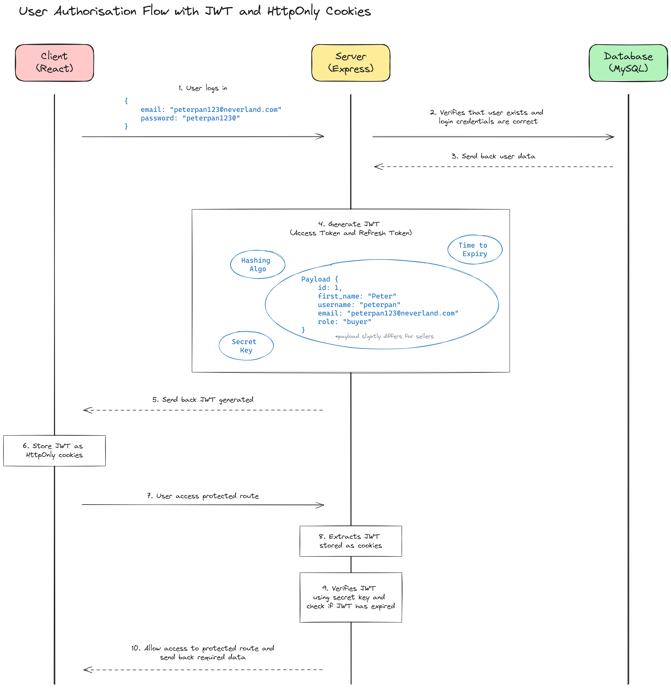

# Capkeybara (Backend)
[Capkeybara](#) is THE ultimate e-commerce platform for top-notch mechanical keyboard components that cater to all your needs! 

  

Whether you're a seasoned keyboard enthusiast, a newbie exploring the world of mechanical keyboards, or simply on the hunt for a quick upgrade, we've got you covered! We are here guide you with expert advice to ensure you make the perfect choice every time you hit that "add to cart" button!

* [Frontend Repository](https://github.com/f-lsq/capkeybara) (ReactJS - useForm, Toastify, Styled Components)
* [Backend Repository](https://github.com/f-lsq/capkeybara-backend) (NodeJS - Express, Handlebars, Bookshelf ORM with knex, DB-migrate, Cloudinary, Stripe, and MySQL)

## Table of Contents
1. [System Design](#system-design)
2. [Functionalities](#functionalities)
2. [Technologies Used](#technologies-used)
4. [Deployment](#deployment)
5. [References](#references)

## System Design
### Entity Relationship Diagram

### SQL Schema Diagram
Given the relationship between entities, a relational DB (in this case MySQL) would be more ideal to store the data. The schema is as shown below.

Do note that the *password* field will be hashed using [bcrypt](https://en.wikipedia.org/wiki/Bcrypt) before it is stored in the DB. 

The following has not been implemented 
* `Discounts` for products
* `2FA` for account signups forgot and update password (nodemailer)

### API Routes for Buyers
Base URL for buyers `http://capkeybara-backend.onrender.com/api/buyers`.
| Endpoint | Method | Description | Request Body | Response | Authentication Response |
|----------|--------|-------------|--------------|----------|-------------------------|
| `/` | GET | Get information of all buyers |   | Status 200 - returns data of all buyers  Status 500 - returns an error message |   |
| `/` | POST | Creates a new buyer   (Incomplete data) | {  &emsp;"username": string,  &emsp;"email": string,  &emsp;"password": string,  &emsp;"confirm_password": string   } | Status 200 - returns a message requesting for more signup details  Status 409 - returns an error message indicating that the buyer username and/or email already exist  Status 500 - returns an error message |   |
| `/` | POST | Creates a new buyer   (Full data) | {  &emsp;"username": string,  &emsp;"email": string,  &emsp;"password": string,  &emsp;"confirm_password": string,  &emsp;"first_name": string,  &emsp;"last_name": string,  &emsp;"contact": string,  &emsp;"address": string   } | Status 201 - returns a success message and data of the new buyer created  Status 400 - returns an error message indicating an error during new account creation  Status 500 - returns an error message |   |
| `/:buyerId` | GET | Get information of a buyer with ID *buyerId* |   | Status 200 - returns a success message and data of the found buyer   Status 400 - returns an error message indicating that the buyer is not found   Status 500 - returns an error message |   |
| `/profile` | POST | Get profile of an authenticated buyer | Valid access token retrieved from cookies  | Status 200 - returns payload of the authenticated buyer   Status 500 - returns an error message | Status 401 - returns an error message requiring buyers to login   Status 403 - returns an error message indicating an invalid access token |
| `/login` | POST | Verifies the login credential of a buyer | {  &emsp;"username": string,  &emsp;"password": string   }  | Status 201 - returns a success message   Status 401 - returns an error message indicating invalid login credentials  Status 500 - returns an error message |   |
| `/refresh` | POST | Refresh an expired access token using the refresh token | Valid refresh token retrieved from cookies  | Status 200 - returns a new access token   Status 500 - returns an error message | Status 401 - returns an error message indicating no refresh token found   Status 403 - returns an error message indicating an invalid refresh token |
| `/logout` | POST | Removes the access and refresh tokens from cookie, and blacklists refresh token when a buyer logs out | Valid refresh token retrieved from cookies  | Status 204 - no response   Status 500 - returns an error message | Status 401 - returns an error message indicating no refresh token found   Status 403 - returns an error message indicating an invalid refresh token |

Potential Improvement for Buyers API route
1. **Hashing password in the frontend before it is sent to the backend.**  Currently the new buyer data is sent over to the backend, with the *password* and *confirm-password* field being strings. This will be subject to [MITM attacks](https://en.wikipedia.org/wiki/Man-in-the-middle_attack). A better alternative is to hash the passwords after the new buyer has submitted his/her datato prevent information from being stolen during transmission.
2. **Filtering the payload information for buyer profile before it is sent to the frontend.**   Upon successful decryption of buyer access token, the payload containing the id, email, first name, username and role of the buyer is returned. Additionally, the 'exp' and 'iat' of the payload is also returned. These information can be filtered out before sending back the data of the buyer to the frontend as they are crucial information for hackers who make use of the access tokens.

### API Routes for Sellers
Base URL for sellers `http://capkeybara-backend.onrender.com/api/sellers`.
| Endpoint | Method | Description | Request Body | Response | Authentication Response |
|----------|--------|-------------|--------------|----------|-------------------------|
| `/` | GET | Get information of all sellers |   | Status 200 - returns data of all sellers  Status 500 - returns an error message |   |
| `/` | POST | Creates a new seller   (Incomplete data) | {  &emsp;"username": string,  &emsp;"email": string,  &emsp;"password": string,  &emsp;"confirm_password": string   } | Status 200 - returns a message requesting for more signup details  Status 409 - returns an error message indicating that the seller username and/or email already exist  Status 500 - returns an error message |   |
| `/` | POST | Creates a new seller   (Full data) | {  &emsp;"username": string,  &emsp;"email": string,  &emsp;"password": string,  &emsp;"confirm_password": string,  &emsp;"name": string,  &emsp;"contact": string,  &emsp;"image_url": string   } | Status 201 - returns a success message and data of the new seller created  Status 400 - returns an error message indicating an error during new account creation  Status 500 - returns an error message |   |
| `/:sellerId` | GET | Get information of a seller with ID *sellerId* |   | Status 200 - returns a success message and data of the found seller   Status 400 - returns an error message indicating that the seller is not found   Status 500 - returns an error message |
| `/profile` | POST | Get profile of an authenticated seller | Valid access token retrieved from cookies  | Status 200 - returns payload of the authenticated seller   Status 500 - returns an error message | Status 401 - returns an error message requiring sellers to login   Status 403 - returns an error message indicating an invalid access token |
| `/login` | POST | Verifies the login credential of a seller | {  &emsp;"username": string,  &emsp;"password": string   }  | Status 201 - returns a success message   Status 401 - returns an error message indicating invalid login credentials  Status 500 - returns an error message |   |
| `/refresh` | POST | Refresh an expired access token using the refresh token | Valid refresh token retrieved from cookies  | Status 200 - returns a new access token   Status 500 - returns an error message | Status 401 - returns an error message indicating no refresh token found   Status 403 - returns an error message indicating an invalid refresh token |
| `/logout` | POST | Removes the access and refresh tokens from cookie, and blacklists refresh token when a seller logs out | Valid refresh token retrieved from cookies  | Status 204 - no response   Status 500 - returns an error message | Status 401 - returns an error message indicating no refresh token found   Status 403 - returns an error message indicating an invalid refresh token |

Potential Improvement for Sellers API route are similar to that of [Buyers](#api-routes-for-buyers).
1. There should also be a **validity check done on the sellers** (possibly using the vendor's UEN), before allowing them to list their products on the website. An additional column can be added to the 'sellers' table in the database to store this information.

### API Routes for Products
Base URL for products `http://capkeybara-backend.onrender.com/api/products`.
| Endpoint | Method | Description | Request Body | Response | Authentication Response |
|----------|--------|-------------|--------------|----------|-------------------------|
| `/` | GET | Get information of all products |   | Status 200 - returns data of all products  Status 500 - returns an error message |   |
| `/categories` | GET | Get information of all product categories |   | Status 200 - returns data of all product categories  Status 500 - returns an error message |   |
| `/seller/:sellerId` | GET | Get all products of a seller with ID *sellerId* |  | Status 200 - returns a success message and data of all products of the specified seller   Status 404 - returns an error message indicating that the specified seller does not exist   Status 500 - returns an error message |   |
| `/` | POST | Creates a new product | {  &emsp;"name": string,  &emsp;"description": string,  &emsp;"price": float,  &emsp;"cost": float,  &emsp;"quantity_available": integer,  &emsp;"image_url": string,  &emsp;"category_id": integer,  &emsp;"seller_id": integer   } | Status 200 - returns a success message indicating that the new product has been created   Status 400 - returns an error message indicating any missing required fields   Status 500 - returns an error message | Status 401 - returns an error message requiring sellers to login   Status 403 - returns an error message indicating an invalid access token |
| `/:productId` | GET | Get information of product with ID *productId* |  | Status 200 - returns a success message and data of the specified product   Status 404 - returns an error message indicating that the specified product does not exist   Status 500 - returns an error message |   |
| `/:productId` | PUT | Updates an existing product with ID *productId* | {  &emsp;"name": string,  &emsp;"description": string,  &emsp;"price": float,  &emsp;"cost": float,  &emsp;"quantity_available": integer,  &emsp;"image_url": string,  &emsp;"category_id": integer,  &emsp;"seller_id": integer   } | Status 200 - returns a success message and the data of the product that was updated   Status 400 - returns an error message indicating any missing or invalid fields   Status 404 - returns an error message indicating that the specified product does not exist   Status 500 - returns an error message | Status 401 - returns an error message requiring sellers to login   Status 403 - returns an error message indicating an invalid access token |
| `/:productId` | DELETE | Deletes an existing product with ID *productId* |   | Status 200 - returns a success message and the data of the product that was deleted   Status 404 - returns an error message indicating that the specified product does not exist   Status 500 - returns an error message | Status 401 - returns an error message requiring sellers to login   Status 403 - returns an error message indicating an invalid access token |
| `/search` | POST | Search for existing products based on the search terms | {  &emsp;"searched_name": string,  &emsp;"searched_brands": array,  &emsp;"searched_categories": array,  &emsp;"searched_availability": string,  &emsp;"searched_price_min": float,  &emsp;"searched_price_max": float   } | Status 200 - returns a success message and the data of the product that was searched   Status 404 - returns an error message indicating that the specified products cannot be found   Status 500 - returns an error message |   |

Potential Improvement for Products API route 
1. **Role specification.**   Currently, any users with a valid access token can perform CRUD operations on the products. Role specification can be added to allow only users with 'seller' and 'admin' roles (and valid access tokens) to manage the products.

### API Routes for Cart
Base URL for cart `http://capkeybara-backend.onrender.com/api/cart`.
| Endpoint | Method | Description | Request Body | Response | Authentication Response |
|----------|--------|-------------|--------------|----------|-------------------------|
| `/:buyerId` | GET | Retrieves the cart items of buyer with ID *buyerId* |   | Status 200 - returns a success message and the data of the cart items of the specified buyer   Status 403 - returns an error message indicating that the specified buyer cannot view another buyer's cart   Status 500 - returns an error message | Status 401 - returns an error message requiring buyers to login   Status 403 - returns an error message indicating an invalid access token |
| `/:buyerId` | POST | Add or increase the quantity by 1 of a cart item for buyer with ID *buyerId* | {  &emsp;"product_id": int   } | Status 200 - returns a success message and the data of the cart item added   Status 400 - returns an error message indicating that the quantity to be added exceeded the quantity available   Status 403 - returns an error message indicating that the specified buyer cannot view another buyer's cart   Status 404 - returns an error message indicating that the specified product does not exist   Status 500 - returns an error message | Status 401 - returns an error message requiring buyers to login   Status 403 - returns an error message indicating an invalid access token |
| `/remove/:buyerId` | POST | Reduce the quantity of a cart item by 1 for buyer with ID *buyerId* | {  &emsp;"product_id": int   } | Status 200 - returns a success message and the data of the cart item reduced   Status 400 - returns an error message indicating that the cart item do not exist or quantity cannot be negative   Status 403 - returns an error message indicating that the specified buyer cannot view another buyer's cart   Status 404 - returns an error message indicating that the specified product does not exist   Status 500 - returns an error message | Status 401 - returns an error message requiring buyers to login   Status 403 - returns an error message indicating an invalid access token |
| `/:buyerId` | PUT | Add or increase the quantity of a cart item for buyer with ID *buyerId* | {  &emsp;"product_id": int  &emsp;"new_quantity": int   } | Status 200 - returns a success message and the data of the cart item updated   Status 400 - returns an error message indicating that the quantity to be added exceeded the quantity available   Status 403 - returns an error message indicating that the specified buyer cannot view another buyer's cart   Status 404 - returns an error message indicating that the specified product does not exist   Status 500 - returns an error message | Status 401 - returns an error message requiring buyers to login   Status 403 - returns an error message indicating an invalid access token |
| `/:buyerId` | DELETE | Remove a cart item entirely for buyer with ID *buyerId* | {  &emsp;"product_id": int   } | Status 200 - returns a success message and the data of the cart item removed   Status 400 - returns an error message indicating that the cart item was not removed   Status 403 - returns an error message indicating that the specified buyer cannot view another buyer's cart   Status 404 - returns an error message indicating that the specified product does not exist   Status 500 - returns an error message | Status 401 - returns an error message requiring buyers to login   Status 403 - returns an error message indicating an invalid access token |

Potential Improvement for Cart API route 
1. **Role specification.**   Currently, any users with a valid access token can perform CRUD operations on the cart items. Role specification can be added to allow only users with 'buyer' and 'admin' roles (and valid access tokens) to manage their cart items.
2. **More specific error validation.**   The error that returns status 400 is does not take into other instances where, for example, users enter data of inapproperiate datatype.

### API Routes for Orders
Base URL for orders `http://capkeybara-backend.onrender.com/api/orders`.
| Endpoint | Method | Description | Request Body | Response | Authentication Response |
|----------|--------|-------------|--------------|----------|-------------------------|
| `/:buyerId` | GET | Retrieves all orders of buyer with ID *buyerId* |   | Status 200 - returns a success message and the data of the orders of the specified buyer   Status 404 - returns an error message indicating that the specified product does not exist   Status 500 - returns an error message | Status 401 - returns an error message requiring buyers to login   Status 403 - returns an error message indicating an invalid access token |
| `/seller/:sellerId` | GET | Retrieves all orders of seller with ID *sellerId* |   | Status 200 - returns a success message and the data of the orders of the specified seller   Status 403 - returns an error message indicating that the specified seller cannot view another seller's orders   Status 500 - returns an error message | Status 401 - returns an error message requiring buyers to login   Status 403 - returns an error message indicating an invalid access token |
| `/:buyerId` | POST | Creates a new order for buyer with *buyerId* based on his/her cart items |   | Status 200 - returns a success message and the data of the order created for the specified buyer   Status 500 - returns an error message | Status 401 - returns an error message requiring buyers to login   Status 403 - returns an error message indicating an invalid access token |
| `/:orderId` | PUT | Updates the order status of order with ID *orderId* | {  &emsp;"order_status": string   } | Status 200 - returns a success message and the data of the updated order   Status 400 - returns an error message indicating that the specified order was not updated   Status 404 - returns an error message indicating that the specified order does not exist   Status 500 - returns an error message | Status 401 - returns an error message requiring buyers to login   Status 403 - returns an error message indicating an invalid access token |

Potential Improvement for Order API route 
1. **Segregation of order status based on sellers.**   Since a order can consist of many products from different sellers, the order status for a order should be separated for each seller. Currently, the order status will update across all sellers with the same order, instead, the order status could be updated from 'Unfulfilled' to 'Completed' after all sellers have updated the status of the order to 'Delivered'.

### API Routes for Checkout
Base URL for checkout `http://capkeybara-backend.onrender.com/api/checkout`.

| Endpoint | Method | Description | Request Body | Response | Authentication Response |
|----------|--------|-------------|--------------|----------|-------------------------|
| `/:userId` | GET | Creates a [Stripe session](https://docs.stripe.com/api/checkout/sessions/create) for user with ID *userId* by retrieving their cart items from the [Cart API](#api-routes-for-cart) |   | Status 200 - returns a session ID   Status 403 - returns an error message indicating that the specified buyer cannot process another buyer's payment   Status 500 - returns an error message | Status 401 - returns an error message requiring buyers to login   Status 403 - returns an error message indicating an invalid access token |

## Functionalities
### User Authorisation
[JSON Web Tokens](https://jwt.io/) (JWT) are used for user authorisation and protection of API routes. 

In Capkeybara's case, the JWT generated by the backend, after a user has successfully logged in, is stored using [HttpOnly Cookies](https://developer.mozilla.org/en-US/docs/Web/HTTP/Cookies). 
The flow is illustrated in the [sequence diagram](https://en.wikipedia.org/wiki/Sequence_diagram) below.

Cookies was chosen over session and localStorage due to its ability to protect against Cross-Site Scripting (XSS) attacks.The `HttpOnly` flag prevents malicious scripts from accessing the cookies, thus providing a better safeguard for user sessions and sensitive information.

A request is sent using a refreshToken to get a new accessToken whenever the accessToken is close to expiry. If the new token fails to be generated, the user has to log in again. Upon log out, the refresh token is added to a black list, preventing it from being reused.

### Product Management
The [product API routes](#api-routes-for-products) allows sellers and admin to create, update and delete products with ease. The product information are also [displayed on the frontend](https://github.com/f-lsq/capkeybara-frontend?tab=readme-ov-file#seller-product-page), allowing easy management. 

### Cart Item Management
The [cart API routes](#api-routes-for-cart) allows buyers to add, update and delete their cart items. These cart items will also be [displayed on the frontend](https://github.com/f-lsq/capkeybara-frontend?tab=readme-ov-file#seller-order-page), allow buyers to view their cart items before checking out.

### Order Creation and Status Management
The [order API routes](#api-routes-for-orders) allows buyers to create their orders upon successful payment, and also allows sellers to [view and manage their orders](https://github.com/f-lsq/capkeybara-frontend?tab=readme-ov-file#seller-order-page) on the client.

### Payment Processing
The third party platform, also known as a [SASS](https://azure.microsoft.com/en-us/resources/cloud-computing-dictionary/what-is-saas),  Stripe, was used to handle payment processing.

1. **Reduce the time and money** required to implement such capability. This will allow resources to be diverted to developing other areas of Capkeybara.
2. **Secure data and prevent legal repercussions** in the case of a data breach. Since Stripe stores the users' sensitive information such as their credit card information, any form of data breach and security incidents will be borne by Stripe rather than Capkeybara.

## Technologies Used
### Frontend
* [ReactJS](https://react.dev/reference/react) - Route access restriction, navigation between pages, form control using useForm
* [Cloudinary](https://cloudinary.com/documentation/upload_widget) - Image upload widget for buyer and seller and product images

### Backend
* [NodeJS](https://nodejs.org/en) - Server environment. [ExpressJS](https://expressjs.com/), [Handlebars](https://handlebarsjs.com/) for admin page templating, [Sessions](https://expressjs.com/en/resources/middleware/session.html), JWT with bcrypt for Authentication, [Bookshelf ORM](https://bookshelfjs.org/) with knex, [Stripe](https://stripe.com/) for payment processing and [caolan form](https://github.com/caolan/forms) for form control.
* [MySQL](https://www.mysql.com/) - Database management, used in conjuntion with [db-migrate](https://db-migrate.readthedocs.io/en/latest/)

## Deployment

<!-- Describe the process that you used to host your website on a hosting platform (such as Github pages or Heroku). Provide the following details:

1.	What is your hosting platform?
2.	How is the database hosted?
3.	What are the environment variables and what are they responsible for?
4.	What are the dependencies that your project used?
5.	What are the deployment steps for the project?

You can provide deployment details in a separate document (PDF or another markdown file). There is no need to be original for this section; if another website or document have the steps, just link there and acknowledge the author in your credits. -->
### Live Links
* [React Frontend - Main Page](https://capkeybara.netlify.app/) (Netlify)
* [Express Backend - Admin Page](https://capkeybara-backend.onrender.com/) (Render)

*(Note that Admin Page is not yet implemented)*

### Test Accounts
| Account Type | Name                                                       | Email                     | Password          | 
|--------------|------------------------------------------------------------|--------------------------|-------------------|
| Buyer        | [Peter Pan](https://en.wikipedia.org/wiki/Peter_Pan)       | peterpan@neverland.com    | peterpan123@      |
| Buyer        | [Tinker Bell](https://en.wikipedia.org/wiki/Tinker_Bell)   | tinkerbell@neverland.com  | tinkerbell123@    | 
| Buyer        | [Captain Hook](https://en.wikipedia.org/wiki/Captain_Hook) | captainhook@neverland.com | captainhook123@   |
| Seller       | [Epomaker](https://epomaker.com/)                          | shop@epomaker.com         | epomaker123@      |
| Seller       | [Aula](https://www.aulastar.com/)                          | shop@aula.com             | aula123@          |
| Seller       | [Keychron](https://www.keychron.com/)                      | shop@keychron.com         | keychron123@      |

No test admin account will be provided.

## References
* [Nadin, P. (2022 September 12). REST API Naming Conventions and Best Practices.](https://medium.com/@nadinCodeHat/rest-api-naming-conventions-and-best-practices-1c4e781eb6a5)
* [Stripe. (n.d.). How Checkout works.](https://docs.stripe.com/payments/checkout/how-checkout-works?payment-ui=stripe-hosted)

